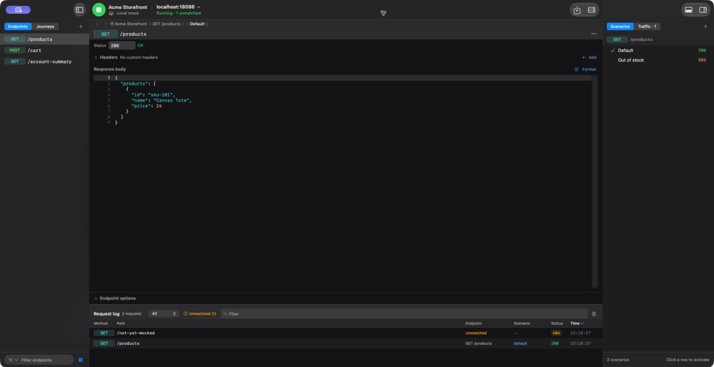

# Mimic

Mimic is a native macOS app that runs local mock API servers. Define endpoints and responses, switch scenarios, script multi-request journeys, simulate failures, and inspect live traffic. A CLI and a token-protected loopback API let tests and agents drive the same project without clicking through the window.

[](https://developer.apple.com/macos/)
[](LICENSE)
[](#testing)
[](#testing)



*Example project: configure a response, switch scenarios, and inspect requests in the same window.*

## Install

Download the [latest release](https://github.com/srpadrono/mimic/releases/latest) and run its signed `.pkg`. It installs `Mimic.app` in `/Applications` and `mimic` in `/usr/local/bin`. To build from source, see [Contributing](CONTRIBUTING.md).

## Try it

```bash
mimic app start
mimic project create "Checkout" --port 8080
mimic endpoint create GET /account-summary --status 200 --body '{"balance":128.4}'
mimic server start
curl http://127.0.0.1:8080/account-summary
```

Edit an endpoint or activate a different scenario while the server runs; the next request uses the new response. Routes can contain `:param` segments. Unmatched requests appear in the request log, where you can turn them into endpoints or journey steps.

A **journey** returns different results as a client moves through a flow. For example, the built-in retry journey fails the first account-summary request and succeeds on the next. Steps can also drop a connection or hold it long enough to exercise a client timeout. See [Journeys](docs/JOURNEYS.md).

```bash
mimic journey add-template retry-after-failure --activate
mimic reset --scope all
mimic journey status
mimic log list --unmatched
```

Projects can have multiple named local ports. Each port can optionally forward unmatched requests to a real upstream, and you can save a complete text response as a local mock. Review captured bodies before sharing a project. See [CLI and control API](docs/CLI.md) and [Security](SECURITY.md).

## Automation

`mimic daemon start` runs the same app without a window. Commands return JSON and meaningful exit codes. `mimic commands` lists the operations supported by the running instance; `mimic state` reports its current state. For isolated automation, use the repository's [CLI end-to-end harness](Scripts/run_cli_e2e.sh), which runs a disposable app copy and store. See [CLI and control API](docs/CLI.md) for discovery, tokens, environment variables, and examples.

HAR and OpenAPI/Swagger **spec import** require the window's review sheet. `mimic project import` instead loads a Mimic project export. An update can be checked from the CLI; installing it requires the macOS installer in the window.

## How it works

The embedded Vapor server runs in the app process. `Domain` owns matching, journey resolution, and project commands; `MockServerEngine` serves requests; `Persistence` stores projects; `AppFeatures` coordinates the window and the single production control host. `ControlPlane` exposes that host over loopback, and `MimicCLICore` is a client. [Architecture](docs/ARCHITECTURE.md) explains the boundaries and where to add behavior.

## Testing

Run `swift test` for portable modules or the focused Xcode checks in [Contributing](CONTRIBUTING.md#test-gates). Local UI checks select the affected test methods; the full UI suite runs only in CI. `./Scripts/ci.sh` runs the local non-UI, Release-build, and CLI gates.

CI publishes coverage badges from merged unit and UI runs on `main`. Line coverage combines the app target and eight first-party modules, weighted by executable lines; the module badge counts how many of those eight reach 95%. Coverage measures exercised lines, not correctness or release acceptance. The optional table below describes its own supplied result bundles and can differ from the badges.

<!-- coverage:generated:start -->
<!-- coverage:generated:end -->

## Reference

- [CLI and control API](docs/CLI.md) — commands, exit codes, discovery, and HTTP format
- [Journeys](docs/JOURNEYS.md) and [GraphQL](docs/GRAPHQL.md) — matching and flow behavior
- [Architecture](docs/ARCHITECTURE.md) — modules and source-of-truth rules
- [Security](SECURITY.md) — local servers, credentials, and captured data
- [Contributing](CONTRIBUTING.md) — build, test, and release commands
- [Roadmap](docs/ROADMAP.md) and [Changelog](CHANGELOG.md) — current limits and release history

MIT licensed. See [LICENSE](LICENSE).
