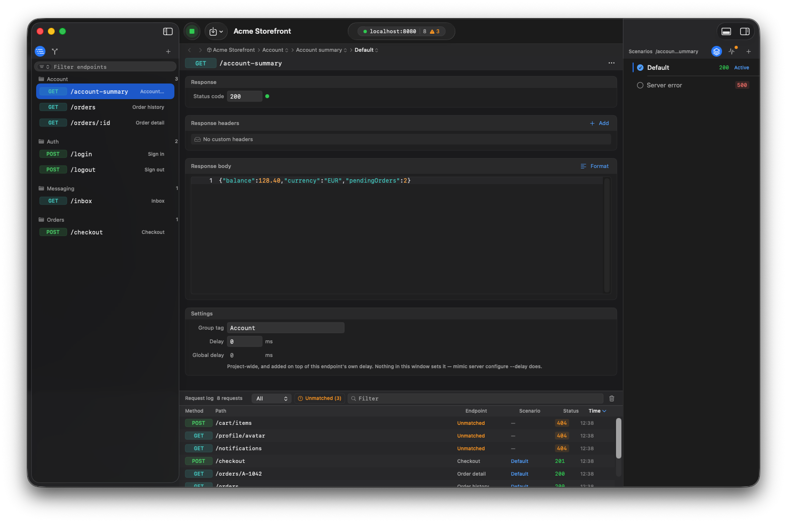
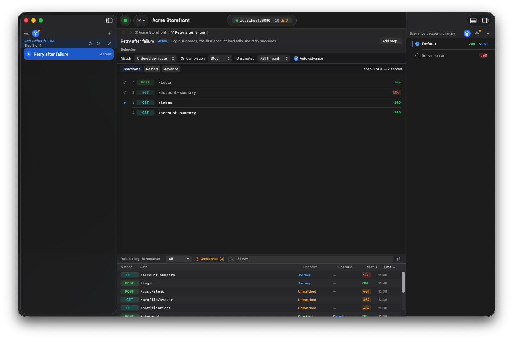
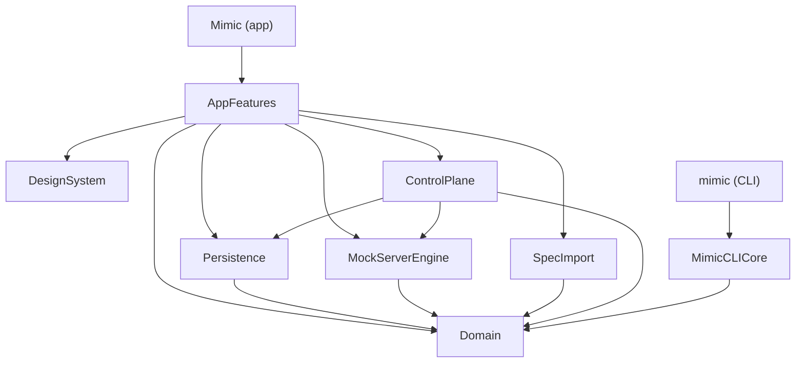

<div align="center">

# Mimic

**A native macOS mock API server — and a testing platform for agents.**

Define endpoints, shape responses, script whole user journeys, simulate latency and network
failures, and watch live traffic. Then drive all of it from a script.

[](https://developer.apple.com/macos/)
[](https://www.swift.org/)
[](#testing)
[](LICENSE)
[](#coverage)
[](#coverage)

[Install](#install) · [Quickstart](#quickstart) · [Journeys](#journeys) · [CLI](docs/CLI.md) · [Architecture](docs/ARCHITECTURE.md)



</div>

## Why Mimic

Most mock servers answer one question: *what does `GET /account-summary` return?* Mimic also answers
the one that actually breaks clients: **what does it return the second time, after the retry?**

- **Journeys, not just stubs.** An ordered script of responses, so the same route can fail and then
  succeed — the retry, the expired session, the maintenance window — reproducibly.
- **Native, not Electron.** A real macOS app: sidebar, editor, inspector, live request-log drawer.
- **Live by default.** Edit an endpoint or switch a scenario and the running server reflects it
  immediately. No restart.
- **Built to be driven.** A deterministic CLI (JSON out, meaningful exit codes) and a
  token-authenticated loopback HTTP control API expose 47 operations — every project, server,
  endpoint, scenario, journey and request-log operation the window has — for test suites and AI
  agents. (Spec import is the exception, and stays in the window; see
  [Import](#more).)
- **Honest failures.** Dropped connections and timeouts, not just 5xx status codes.
- **Small on purpose.** A sharp feature set, done well.

## Install

**Download the installer** — [latest release](https://github.com/srpadrono/mimic/releases/latest).
Open the `.pkg` and follow the prompts. It puts `Mimic.app` in `/Applications` and the `mimic`
command in `/usr/local/bin` in one step, so there is nothing to drag and nothing to add to `PATH`:

```bash
mimic --version
```

**Or build from source** — see [CONTRIBUTING.md](CONTRIBUTING.md).

> The installer is signed with a Developer ID and notarised by Apple, with the ticket stapled so it
> validates offline. It installs with no warning.

## Quickstart

```bash
mimic app start                    # launch Mimic and wait until it answers
mimic project create "Checkout" --port 8080
mimic endpoint create GET /account-summary --status 200 --body '{"balance":128.4}'
mimic server start

curl localhost:8080/account-summary        # {"balance":128.4}
```

Everything above is also a click in the window, and the two reach it the same way: an endpoint or
scenario edit is applied by `ProjectCommandExecutor` in `Domain` whichever surface asked, and the
stateful rest — project selection, server lifecycle, the journey cursor, the log — goes through the
one `AppState` the window is drawing. `mimic project create` runs `appState.createProject`, the same
call the New Project sheet makes.

## Journeys

An endpoint says what a route returns. A journey says what it returns **in sequence**:

```bash
mimic journey add-template retry-after-failure --activate
mimic server start

curl -X POST localhost:8080/login            # 200
curl       localhost:8080/account-summary    # 500  ← first load fails
curl       localhost:8080/inbox              # 200  ← user moves on
curl       localhost:8080/account-summary    # 200  ← retry succeeds
```

Journeys live in the sidebar's **Journeys** tab (⌘2), beside the endpoints they override — selecting
one opens its steps in the editor, with the run controls and live progress above them.



Served steps are ticked, the cursor marks what answers next, and the request log names the journey
that answered — so a flow mid-run tells you where it is without guessing.

Steps can respond (status, headers, body, delay, repeat count) or **fail at the transport level** —
a dropped connection or a timeout, which exercise retry and offline code that no status code can
reach. Requests a journey doesn't script fall through to your endpoints, so a journey only describes
the steps that matter.

Nine templates cover the flows teams reproduce most: retry after failure (the one above), payment
retry, session expiry, MFA challenge, maintenance window, progressive loading, offline-to-online,
feature-flag rollout, edge cases.

→ [docs/JOURNEYS.md](docs/JOURNEYS.md)

## Finding the mocks you're missing

Every request is logged — including ones nothing is configured for. Those are labelled **Unmatched**
rather than left as a bare 404, because an endpoint that deliberately returns 404 is not the same
thing, and neither is a request a journey answered.

```bash
mimic log list --unmatched --format text
```
```
2026-07-30T14:20:22Z  GET   /user/profile        404   Unmatched
2026-07-30T14:20:22Z  POST  /analytics/events    404   Unmatched
```

In the window, the `Unmatched (n)` filter narrows to exactly the calls your client makes and you
haven't mocked. Right-click one to create the endpoint from it — or to append it to a journey,
copying the response it received into the step, so a flow can be built by running it once.

**Or capture the whole session.** ⌘-click to pick calls out of the log, ⇧-click to take a stretch of
it, then right-click the selection and save it as a journey. Steps come out in the order the calls
actually arrived — not the order the table happens to be sorted — and a run of identical polls
collapses into one step that repeats, so six `202`s before a `200` script themselves correctly.

Selecting a log entry opens the whole exchange in the inspector — request and response, headers and
bodies, formatted and searchable — so checking what a mock returned doesn't mean opening the editor.

## More

- **Scenarios** — multiple responses per endpoint, one active, switchable live.
- **Import** — HAR captures and OpenAPI/Swagger specs (JSON) become reviewable, normalized endpoints.
  **This one is window-only.** There is no `mimic import`: parsing a spec lives in the `SpecImport`
  module, which only the app links, so a script that wants a spec's routes reads the file itself and
  issues `mimic endpoint create` and `mimic scenario update` per route — the same two commands the
  review sheet runs when you confirm it, so the result is identical. (`mimic project import` is a
  different operation: it reads a Mimic project export.)
- **GraphQL** — every operation hits one path, so Mimic matches on the operation instead, with a
  fallback chain that works even when the client sends no `operationName`.
  → [docs/GRAPHQL.md](docs/GRAPHQL.md)
- **Latency** — additive global and per-endpoint delays, applied before responding.
- **Path matching** — `:param` wildcards, most-specific route wins.

## Driving Mimic from a test suite

```bash
export MIMIC_DATABASE_PATH="$PWD/.mimic-ci/store.sqlite"   # isolated store
export MIMIC_CONTROL_FILE="$PWD/.mimic-ci/control.json"    # isolated discovery file
export MIMIC_CONTROL_PORT=18787                            # …and the port to reach it on
export MIMIC_CONTROL_TOKEN="$(uuidgen)"                    # …and the credential, since the file moved

mimic daemon start                          # headless: the app, windowless
mimic project import fixtures/checkout.json # a `mimic project export` document, not an OpenAPI spec
mimic journey activate "Session expiry"
mimic reset --scope all                     # rewind the journey, clear the log

# … drive the app under test against http://127.0.0.1:8080 …

mimic journey status | jq -e '.journeyStatus.isComplete'
```

`MIMIC_CONTROL_FILE` keeps a CI run out of a developer's `control.json` — the app writes and searches
there instead of in Application Support. The port is exported alongside it because the CLI does not
read that variable yet (it carries its own copy of the discovery reader), and `MIMIC_CONTROL_PORT`
wins before discovery is consulted. `MIMIC_CONTROL_TOKEN` has to be set too: moving the file means
`mimic` cannot read the token out of it, and the port variables carry a destination rather than a
credential. → [docs/CLI.md](docs/CLI.md#environment).

The CLI is a thin client over a loopback HTTP API, so a non-Swift agent can skip it entirely. Every
request carries the instance's token, which it mints at startup and writes to its discovery file.
That token is scoped to the instance that minted it: the CLI attaches a discovered token only to a
loopback host on the port that file advertised, so pointing `--url` somewhere else does not take the
credential with it.

```bash
# The installed app is sandboxed, so its Application Support is inside its container.
CONTROL=~/Library/Containers/devxa.Mimic/Data/Library/Application\ Support/devxa.Mimic/control.json
TOKEN=$(python3 -c 'import json,sys;print(json.load(sys.stdin)["token"])' < "$CONTROL")

curl -s -H "X-Mimic-Token: $TOKEN" \
  http://127.0.0.1:8787/v1/commands                # ask what this instance accepts
curl -s -X POST http://127.0.0.1:8787/v1/command \
  -H "X-Mimic-Token: $TOKEN" \
  -H 'Content-Type: application/json' \
  -d '{"journeyActivate":{"journey":{"name":"Session expiry"}}}'
```

→ [docs/CLI.md](docs/CLI.md) for the full reference.

## Architecture

Mimic favours **deep modules** with small public surfaces. The embedded Vapor server runs
**in-process** — the app talks to it through direct Swift calls, never HTTP-to-self.



| Module | Responsibility |
| --- | --- |
| `Domain` | Value types and pure rules: matching, resolution, journeys, the command language. Foundation only. |
| `MockServerEngine` | The embedded Vapor runtime: start/stop, serving, the request-log stream. |
| `Persistence` | GRDB storage behind a `ProjectRepository` port. |
| `SpecImport` | HAR / OpenAPI / Swagger → normalized import candidates. |
| `ControlPlane` | The automation surface: a loopback-only HTTP API over the same engine and store the window uses. Also holds a windowless composition root that nothing currently reaches — see below. |
| `MimicCLICore` | The whole `mimic` command surface, as a testable library. Links neither Vapor nor GRDB. |
| `DesignSystem` | SwiftUI tokens and components. No Domain coupling. |
| `AppFeatures` | Screens, navigation, and the `AppState` coordinator — the only module that knows full workflows. |

The rule that keeps the window and the CLI honest: **every project-scoped operation is applied by
`ProjectCommandExecutor` in `Domain`**, which all three surfaces call. A rule can only be written
once.

### Known issue: `mimic daemon start` runs the app, not the daemon

`ControlPlane` contains `MimicDaemon` and `MimicControlService` — a full windowless Mimic, store and
engine and command handling included. Nothing reaches them. `mimic daemon start` sets `--headless` on
`mimic app start`, which launches `Mimic.app` with `MIMIC_HEADLESS=1`; the app hides itself from the
Dock and serves the control API through `AppControlHost`, exactly as it does with a window open.
Nothing outside `MimicDaemon.swift` names the type:

```bash
grep -rn MimicDaemon --include=*.swift . | grep -v '^\./Sources/ControlPlane/MimicDaemon\.swift:'
```

prints nothing. (The unfiltered grep used to be quoted here as returning "one hit, its own
declaration". It returns two — a doc comment in that file now quotes the grep, so the check moved its
own result.)

Nothing is broken by this — headless works, and it works through the same code path a developer
watches all day, which is a real argument in its favour. What it costs is honesty about the tests:
every host-level test in `ControlPlaneTests` exercises the host that does not ship, while the host that does had
no unit test at all until four behavioural divergences between the two had already been released.
Whether to wire the daemon up or delete it is an open question; leaving the documentation implying
that CI runs a separate daemon is not. See
[AGENTS.md](AGENTS.md#two-hosts-one-of-them-shipped--a-known-issue) and
[docs/ARCHITECTURE.md](docs/ARCHITECTURE.md#two-hosts-one-shipped).

→ [docs/ARCHITECTURE.md](docs/ARCHITECTURE.md) for the domain language and the reasoning.

## Testing

851 tests, counted as `@Test` and `func test` declarations — a parameterized case runs more than
once and is still one declaration. Swift Testing for units and integration, XCTest with page objects
for UI.

| Suite | Count | Where it runs |
|-------|-------|---------------|
| Domain, persistence, engine, control plane, import, CLI | 547 | Linux or macOS — `swift test` |
| Design system | 47 | macOS — needs SwiftUI |
| App and coordination | 217 | macOS — hosted by the app |
| macOS UI (XCUITest) | 40 | macOS, interactive session |

The portable 547 break down as Domain 178, SpecImport 107, MimicCLICore 85, MockServerEngine 65,
Persistence 65, ControlPlane 47. The app's 217 are the six folders `MimicTests` builds —
`WorkspaceFeatureTests` 92, `MimicTests` 88, `JourneyFeatureTests` 14, `ImportFeatureTests` 13,
`ProjectFeatureTests` 6, `EndpointFeatureTests` 4.

`JourneyFeatureTests` is new, and it closes something this section used to state as a decision:
`Sources/AppFeatures/JourneyFeature` was described here as deliberately having no suite of its own
because `MimicTests` covered the journey UI. It was the one feature folder with no tests at all.
`Project.swift` now lists `Tests/JourneyFeatureTests` among the folders the `MimicTests` target
builds, and the directory exists behind it.

Only the SwiftUI layer needs a Mac. The domain rules, mock engine, persistence, control plane, spec
import and CLI are plain Swift, so [`Package.swift`](Package.swift) builds them anywhere while
[`Project.swift`](Project.swift) (Tuist) builds the app. Both manifests declare those modules from
the *same* directories, so they cannot drift in what they compile — but they resolve their
dependencies into two separate lockfiles, and that pair *can* drift, so CI checks the two agree
before it builds anything.

```bash
swift test                    # the portable 547, no Xcode needed
./Scripts/ci.sh               # full local gate: build, all suites, Release, UI tests
```

The **Tests** badge at the top is hand-maintained, unlike the two coverage badges beside it, which
`Scripts/update_readme_coverage.py` rewrites and which make the script fail loudly if the README has
lost them. That asymmetry is why the counts above keep drifting: the table has twice claimed a
figure the tree did not support — 469 / 34 / 181 against an actual 487 / 49 / 173, then 173 for the
app row while a new parity suite was landing 13 more in the same afternoon. A hand count is only ever
true of the commit that wrote it. It no longer has to be recounted by eye —
[`Scripts/check_doc_counts.py`](Scripts/check_doc_counts.py) recounts every folder and fails naming
each number here that has drifted:

```bash
python3 Scripts/check_doc_counts.py    # also run by ./Scripts/ci.sh and by the Linux CI job
```

It exits 0 against this table today. It also fails on a suite folder that exists and appears in none
of its groups, which is what a newly added suite looks like before anybody writes it in — and is how
`JourneyFeatureTests` was caught, hours after being created.

### Coverage

<!-- coverage:generated:start -->
**Coverage has not been measured for this commit, and the two badges above say so rather than
carrying a stale number.** They read `not measured` because nothing has run
[`./Scripts/run_full_test_suite.sh`](Scripts/run_full_test_suite.sh) here — that script needs macOS
and Xcode (it drives `xcodebuild` and reads the resulting `.xcresult` bundles with `xcrun xccov`),
and the environments most of this tree's recent editing happened in have neither.

This is a placeholder in the sense that the numbers are absent, but not in the sense that somebody
forgot: running the script on a Mac rewrites this block and both badges from the measured bundles.
Until then, an absent number is the honest one — the alternative is a figure quoted from a run
nobody can point at, which is precisely how the test counts above drifted twice.

```bash
./Scripts/run_full_test_suite.sh    # macOS + Xcode; rewrites this section and the two badges
```
<!-- coverage:generated:end -->

[`.github/workflows/ci.yml`](.github/workflows/ci.yml) runs on every pull request and every push to
`main`, in two jobs: Linux builds `Package.swift` and runs the portable suites in a couple of
minutes, macOS runs `tuist generate`, the Debug build, the app-level suites, XCUITest and the Release
gate. Both runners are free on a public repository. (This section used to say Actions could not start
a job here at all — true while the repository was private and a billing block killed every run in
about two seconds; making it public resolved it.)

## Documentation

| Doc | What's in it |
|-----|--------------|
| [Journeys](docs/JOURNEYS.md) | The model, matching modes, transport failures, the template library. |
| [CLI](docs/CLI.md) | Every command, the exit-code contract, and the HTTP control API. |
| [GraphQL](docs/GRAPHQL.md) | Matching by operation, precedence, and import behaviour. |
| [Architecture](docs/ARCHITECTURE.md) | Domain language, module map, and the reasoning behind both. |
| [Security](SECURITY.md) | What the two servers expose, how the control API is authenticated, and what captured traffic contains. |
| [Contributing](CONTRIBUTING.md) | Building from source, the test gates, and how to add an operation. |
| [Changelog](CHANGELOG.md) | What changed in each release. |
| [Roadmap](docs/ROADMAP.md) | What's built and what's next. |

## License

[MIT](LICENSE).
