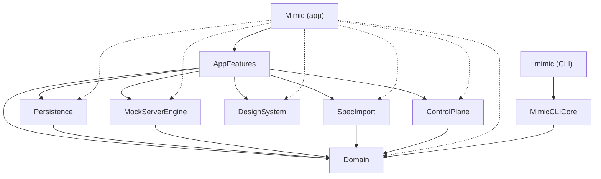

<div align="center">

# Mimic

**A native macOS mock API server — and a testing platform for agents.**

Define endpoints, shape responses, script whole user journeys, simulate latency and network
failures, and watch live traffic. Then drive all of it from a script.

[](https://developer.apple.com/macos/)
[](https://www.swift.org/)
[](#testing)
[](LICENSE)
[](#coverage)
[](#coverage)

[Install](#install) · [Quickstart](#quickstart) · [Journeys](#journeys) · [CLI](docs/CLI.md) · [Architecture](docs/ARCHITECTURE.md)


</div>

## Why Mimic

Most mock servers answer one question: *what does `GET /account-summary` return?* Mimic also answers
the one that actually breaks clients: **what does it return the second time, after the retry?**

- **Journeys, not just stubs.** An ordered script of responses, so the same route can fail and then
  succeed — the retry, the expired session, the maintenance window — reproducibly.
- **Native, not Electron.** A real macOS app: sidebar, editor, inspector, live request-log drawer.
- **Live by default.** Edit an endpoint or switch a scenario and the running server reflects it
  immediately. No restart.
- **Built to be driven.** A deterministic CLI (JSON out, meaningful exit codes) and a
  token-authenticated loopback HTTP control API expose 47 operations — every project, server,
  endpoint, scenario, journey and request-log operation the window has — for test suites and AI
  agents. (Spec import is the exception, and stays in the window; see
  [Import](#more).)
- **Honest failures.** Dropped connections and timeouts, not just 5xx status codes.
- **Small on purpose.** A sharp feature set, done well.

## Install

**Download the installer** — [latest release](https://github.com/srpadrono/mimic/releases/latest).
Open the `.pkg` and follow the prompts. It puts `Mimic.app` in `/Applications` and the `mimic`
command in `/usr/local/bin` in one step, so there is nothing to drag and nothing to add to `PATH`:

```bash
mimic --version
```

**Or build from source** — see [CONTRIBUTING.md](CONTRIBUTING.md).

> The installer is signed with a Developer ID and notarised by Apple, with the ticket stapled so it
> validates offline. It installs with no warning.

## Quickstart

```bash
mimic app start                    # launch Mimic and wait until it answers
mimic project create "Checkout" --port 8080
mimic endpoint create GET /account-summary --status 200 --body '{"balance":128.4}'
mimic server start

curl localhost:8080/account-summary        # {"balance":128.4}
```

Everything above is also a click in the window, and the two reach it the same way: an endpoint or
scenario edit is applied by `ProjectCommandExecutor` in `Domain` whichever surface asked, and the
stateful rest — project selection, server lifecycle, the journey cursor, the log — goes through the
one `AppState` the window is drawing. `mimic project create` runs `appState.createProject`, the same
call the New Project sheet makes.

## Journeys

An endpoint says what a route returns. A journey says what it returns **in sequence**:

```bash
mimic journey add-template retry-after-failure --activate
mimic server start

curl -X POST localhost:8080/login            # 200
curl       localhost:8080/account-summary    # 500  ← first load fails
curl       localhost:8080/inbox              # 200  ← user moves on
curl       localhost:8080/account-summary    # 200  ← retry succeeds
```

Journeys live in the sidebar's **Journeys** tab (⌘2), beside the endpoints they override — selecting
one opens its steps in the editor, with the run controls and live progress above them.


Served steps are ticked, the cursor marks what answers next, and the request log names the journey
that answered — so a flow mid-run tells you where it is without guessing.

Steps can respond (status, headers, body, delay, repeat count) or **fail at the transport level** —
a dropped connection or a timeout, which exercise retry and offline code that no status code can
reach. Requests a journey doesn't script fall through to your endpoints, so a journey only describes
the steps that matter.

Nine templates cover the flows teams reproduce most: retry after failure (the one above), payment
retry, session expiry, MFA challenge, maintenance window, progressive loading, offline-to-online,
feature-flag rollout, edge cases.

→ [docs/JOURNEYS.md](docs/JOURNEYS.md)

## Finding the mocks you're missing

Every request is logged — including ones nothing is configured for. Those are labelled **Unmatched**
rather than left as a bare 404, because an endpoint that deliberately returns 404 is not the same
thing, and neither is a request a journey answered.

```bash
mimic log list --unmatched --format text
```
```
2026-07-30T14:20:22Z  GET   /user/profile        404   Unmatched
2026-07-30T14:20:22Z  POST  /analytics/events    404   Unmatched
```

In the window, the `Unmatched (n)` filter narrows to exactly the calls your client makes and you
haven't mocked. Right-click one to create the endpoint from it — or to append it to a journey,
copying the response it received into the step, so a flow can be built by running it once.

**Or capture the whole session.** ⌘-click to pick calls out of the log, ⇧-click to take a stretch of
it, then right-click the selection and save it as a journey. Steps come out in the order the calls
actually arrived — not the order the table happens to be sorted — and a run of identical polls
collapses into one step that repeats, so six `202`s before a `200` script themselves correctly.

Selecting a log entry opens the whole exchange in the inspector — request and response, headers and
bodies, formatted and searchable — so checking what a mock returned doesn't mean opening the editor.

## More

- **Scenarios** — multiple responses per endpoint, one active, switchable live.
- **Import** — HAR captures and OpenAPI/Swagger specs (JSON) become reviewable, normalized endpoints.
  **This one is window-only.** There is no `mimic import`: parsing a spec lives in the `SpecImport`
  module, which only the app links, so a script that wants a spec's routes reads the file itself and
  issues `mimic endpoint create` and `mimic scenario update` per route — the same two commands the
  review sheet runs when you confirm it, so the result is identical. (`mimic project import` is a
  different operation: it reads a Mimic project export.)
- **GraphQL** — every operation hits one path, so Mimic matches on the operation instead, with a
  fallback chain that works even when the client sends no `operationName`.
  → [docs/GRAPHQL.md](docs/GRAPHQL.md)
- **Latency** — additive global and per-endpoint delays, applied before responding.
- **Path matching** — `:param` wildcards, most-specific route wins.

## Driving Mimic from a test suite

```bash
export MIMIC_DATABASE_PATH="$PWD/.mimic-ci/store.sqlite"   # isolated store
export MIMIC_CONTROL_FILE="$PWD/.mimic-ci/control.json"    # isolated discovery file
export MIMIC_CONTROL_PORT=18787                            # …the port this instance binds (off a dev's 8787)
export MIMIC_CONTROL_TOKEN="$(uuidgen)"                    # …fresh credential per run

mimic daemon start                          # headless: the app, windowless
mimic project import fixtures/checkout.json # a `mimic project export` document, not an OpenAPI spec
mimic journey activate "Session expiry"
mimic reset --scope all                     # rewind the journey, clear the log

# … drive the app under test against http://127.0.0.1:8080 …

mimic journey status | jq -e '.journeyStatus.isComplete'
```

`MIMIC_CONTROL_FILE` keeps a CI run out of a developer's `control.json` — the instance writes there
and `mimic` searches *only* there, through the one discovery reader (`ControlEndpointDiscovery` in
`Domain`), so the destination and the token both come out of the relocated file. `MIMIC_CONTROL_PORT`
is exported for the instance's own bind, keeping the run off the default 8787 a developer's Mimic may
hold, and a fresh `MIMIC_CONTROL_TOKEN` per run means a leftover file from an earlier run cannot
authenticate against this one; neither is needed for discovery any more.
→ [docs/CLI.md](docs/CLI.md#environment).

The CLI is a thin client over a loopback HTTP API, so a non-Swift agent can skip it entirely. Every
request carries the instance's token, which it mints at startup and writes to its discovery file.
That token is scoped to the instance that minted it: the CLI attaches a discovered token only to a
loopback host on the port that file advertised, so pointing `--url` somewhere else does not take the
credential with it.

```bash
# The installed app is sandboxed, so its Application Support is inside its container.
CONTROL=~/Library/Containers/devxa.Mimic/Data/Library/Application\ Support/devxa.Mimic/control.json
TOKEN=$(python3 -c 'import json,sys;print(json.load(sys.stdin)["token"])' < "$CONTROL")

curl -s -H "X-Mimic-Token: $TOKEN" \
  http://127.0.0.1:8787/v1/commands                # ask what this instance accepts
curl -s -X POST http://127.0.0.1:8787/v1/command \
  -H "X-Mimic-Token: $TOKEN" \
  -H 'Content-Type: application/json' \
  -d '{"journeyActivate":{"journey":{"name":"Session expiry"}}}'
```

→ [docs/CLI.md](docs/CLI.md) for the full reference.

## Architecture

Mimic favours **deep modules** with small public surfaces. The embedded Vapor server runs
**in-process** — the app talks to it through direct Swift calls, never HTTP-to-self.



The dotted edges are the app target's own links: `Project.swift` declares every module as a
dependency of `Mimic`, because the app is the composition root that bundles the frameworks it
ships. The code under `App/Sources` imports no module of this repository but `AppFeatures` (plus
the system frameworks) — the solid edge is the only one that carries calls.

| Module | Responsibility |
| --- | --- |
| `Domain` | Value types and pure rules: matching, resolution, journeys, the command language. Foundation only. |
| `MockServerEngine` | The embedded Vapor runtime: start/stop, serving, the request-log stream. |
| `Persistence` | GRDB storage behind a `ProjectRepository` port. |
| `SpecImport` | HAR / OpenAPI / Swagger → normalized import candidates. |
| `ControlPlane` | The automation surface: a loopback-only HTTP API and the discovery file, over the `ControlHost` protocol the app implements. Domain and Vapor only. |
| `MimicCLICore` | The whole `mimic` command surface, as a testable library. Links neither Vapor nor GRDB. |
| `DesignSystem` | SwiftUI tokens and components. No Domain coupling. |
| `AppFeatures` | Screens, navigation, and the `AppState` coordinator — the only module that knows full workflows. |

The rule that keeps the window and the CLI honest: **every project-scoped operation is applied by
`ProjectCommandExecutor` in `Domain`**, which all three surfaces call. A rule can only be written
once.

### One host: `mimic daemon start` runs the app, headless

`mimic daemon start` sets `--headless` on `mimic app start`, which launches `Mimic.app` with
`MIMIC_HEADLESS=1`; the app hides itself from the Dock and serves the control API through
`AppControlHost`, exactly as it does with a window open. Headless is a mode of the app, not a
separate process — and that code path is the one a developer watches all day, which is a real
argument in its favour.

It used to be half of a known issue. `ControlPlane` also contained `MimicDaemon` and
`MimicControlService` — a full windowless Mimic, store and engine and command handling included —
that nothing in production ever constructed, while every host-level test in `ControlPlaneTests`
exercised it rather than the host that ships. The owner resolved the fork by deleting the pair:
`ControlPlane` now holds the HTTP server, the discovery file and the `ControlHost` protocol, depends
on `Domain` and Vapor alone, and `Scripts/check_module_edges.py` fails CI if an edge onto a store or
an engine reappears under it. The sweeps in `Tests/MimicTests/HostCommandSweepTests.swift` drive
every command through the shipped host. See [AGENTS.md](AGENTS.md#one-host) and
[docs/ARCHITECTURE.md](docs/ARCHITECTURE.md).

→ [docs/ARCHITECTURE.md](docs/ARCHITECTURE.md) for the domain language and the reasoning.

## Testing

1192 tests, counted as `@Test` and `func test` declarations — a parameterized case runs many times
and is still one declaration. Swift Testing for units, XCTest with page objects for UI.

| Suite | Count | Where it runs |
|-------|-------|---------------|
| Domain, persistence, engine, control plane, import, CLI | 662 | Linux or macOS — `swift test` |
| Design system | 72 | macOS — needs SwiftUI |
| App and coordination | 300 | macOS — hosted by the app |
| macOS UI (XCUITest) | 158 | macOS, interactive session |

The portable 662 break down as Domain 260, SpecImport 128, MimicCLICore 113, MockServerEngine 70,
Persistence 69, ControlPlane 22. The app's 300 are the six folders `MimicTests` builds —
`WorkspaceFeatureTests` 113, `MimicTests` 143, `JourneyFeatureTests` 14, `ImportFeatureTests` 15,
`ProjectFeatureTests` 6, `EndpointFeatureTests` 9 — hand counts, two of which have been wrong, which
is what the last command below is for. Only the SwiftUI layer needs a Mac; the rest is plain Swift,
which is why [`Package.swift`](Package.swift) builds most of this anywhere.

```bash
swift test                             # the portable 662, no Xcode needed
./Scripts/ci.sh                        # the full local gate: build, suites, Release, UI, CLI e2e
./Scripts/run_full_test_suite.sh       # macOS + Xcode; also rewrites the coverage section below
python3 Scripts/check_doc_counts.py    # recount every number above, and catch a suite nobody runs
```

### Coverage

**Coverage is measured on every CI run**, with `-enableCodeCoverage YES` on the unit suites and on
all three XCUITest shards. No floor is enforced against the figures.

**The badges are the union of the four**, not a sum. Coverage is a set over executed lines, so four
sets of per-target numbers cannot be added — a line two suites both reach is one covered line. The
four result bundles are merged with `xcrun xcresulttool merge` and read once, which is what the
`Coverage (unit suites + XCUITest)` job does on every push to `main` before the figures are
published to an orphan `badges` branch as shields.io endpoint payloads. Nothing in the tree changes
when they move.

That merge is why the numbers moved. Until it existed the badges came from a run passing
`-skip-testing:MimicUITests`, so all 158 UI tests — the only ones that touch the SwiftUI layer —
contributed nothing to the published figure for how well this window is tested.

**The first badge is the weighted total over all nine targets** — covered lines divided by
executable lines, once, not a mean of nine percentages. Summing across targets is exact where
summing across *runs* would not be: the nine are disjoint sets of source files in one already-merged
report, so no line is counted twice.

It used to read `Mimic.app coverage`, and it measured the target of that name — which is
`App/Sources/MimicApp.swift`, 34 lines of `@main` entry point. It published `46.67%` and readers
took that for a statement about the application. The application is `AppFeatures`; `Mimic.app` keeps
its row in the table below.

A run that publishes nothing leaves both badges showing the last figures that did publish —
deliberately, since a stale number is recoverable and a quietly wrong one is not.

The detailed per-target block below is the other half, and it is deliberately local-only —
`./Scripts/run_full_test_suite.sh` on a Mac is its only writer, so it is as fresh as the last full
run somebody did by hand.

<!-- coverage:generated:start -->
<!-- coverage:generated:end -->

[`.github/workflows/ci.yml`](.github/workflows/ci.yml) runs on every pull request and every push to
`main`, in eight jobs across six definitions, finishing in about **30 minutes**: Linux builds
`Package.swift`, the portable suites and every gate needing no toolchain in a couple of minutes;
macOS does `tuist generate`, the Debug build, the measured app suites, the CLI end-to-end check and
the Release gate, with the XCUITest suite beside it in three shards on three runners. Four of those
eight run at once, which is the concurrent-macOS-job limit this repository was measured to get; the
coverage merge is a fifth macOS job and adds no queue, because it starts only once all four have
finished — and only on a push to `main`, so a pull request's 30 minutes is untouched. Both runners
are free on a public repository. Why the work divides that way, and what each gate settles, is in
[`ci.md`](.agents/skills/mimic-build-and-test/references/ci.md).

## Documentation

| Doc | What's in it |
|-----|--------------|
| [Journeys](docs/JOURNEYS.md) | The model, matching modes, transport failures, the template library. |
| [CLI](docs/CLI.md) | Every command, the exit-code contract, and the HTTP control API. |
| [GraphQL](docs/GRAPHQL.md) | Matching by operation, precedence, and import behaviour. |
| [Architecture](docs/ARCHITECTURE.md) | Domain language, module map, and the reasoning behind both. |
| [Security](SECURITY.md) | What the two servers expose, how the control API is authenticated, and what captured traffic contains. |
| [Contributing](CONTRIBUTING.md) | Building from source, the test gates, and how to add an operation. |
| [Changelog](CHANGELOG.md) | What changed in each release. |
| [Roadmap](docs/ROADMAP.md) | What's built and what's next. |

## License

[MIT](LICENSE).
