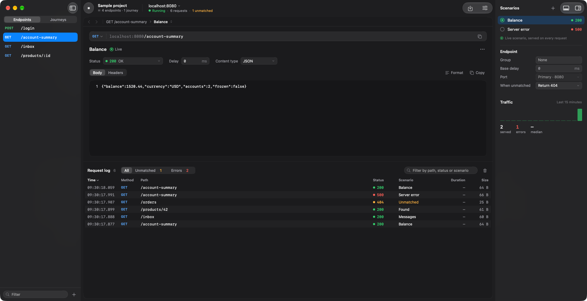
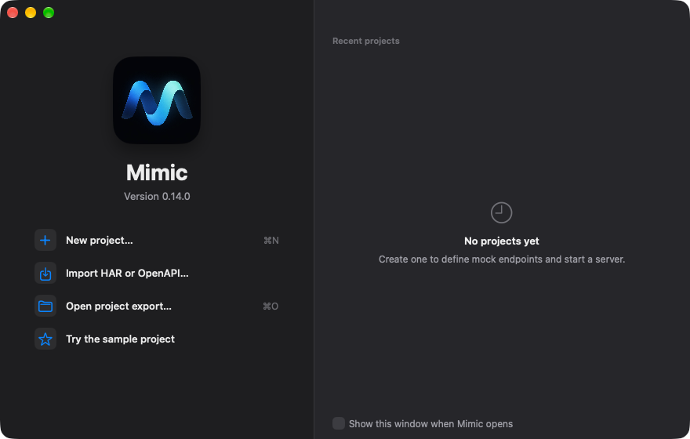
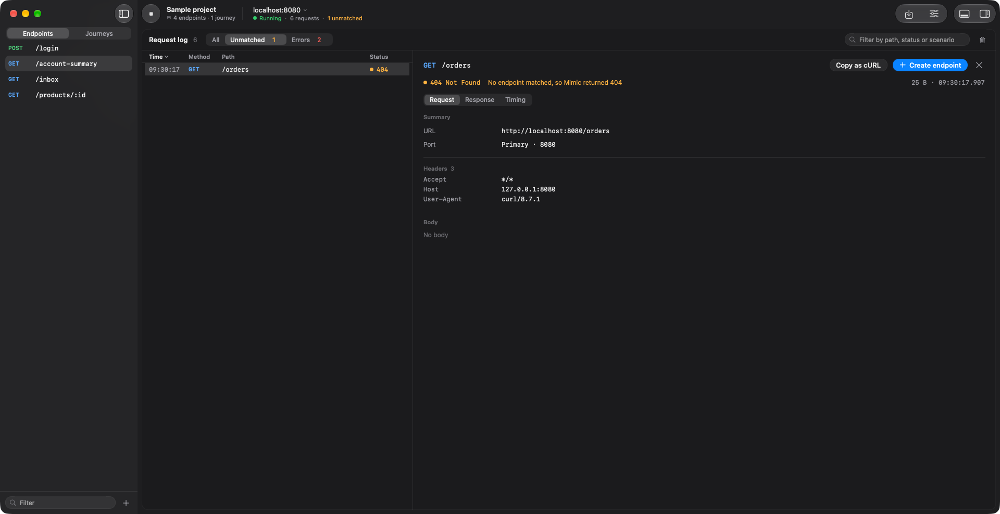
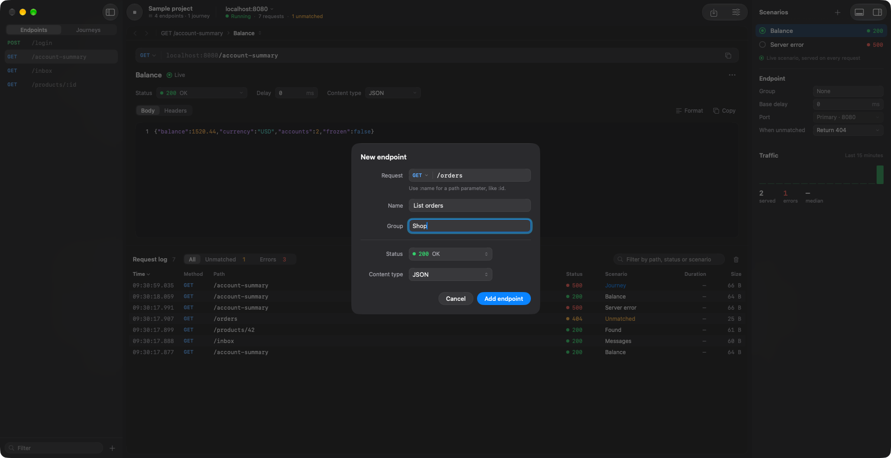
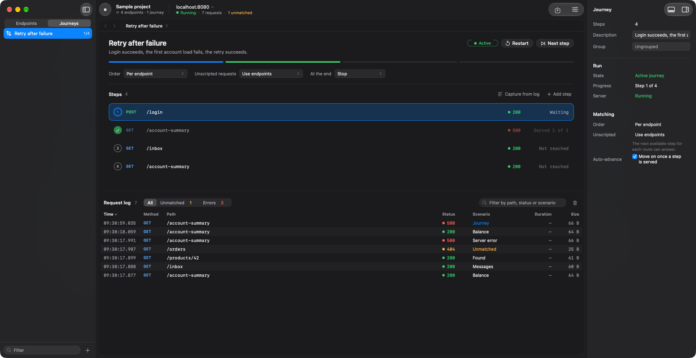
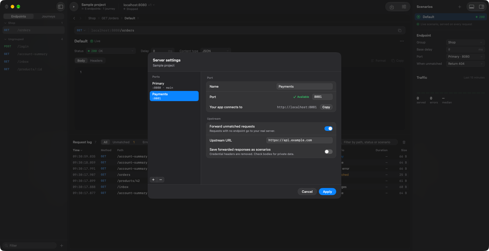
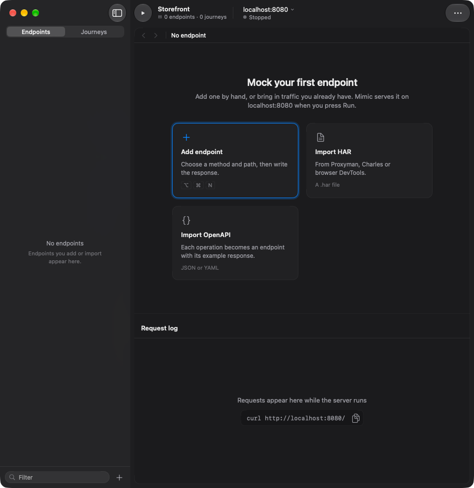
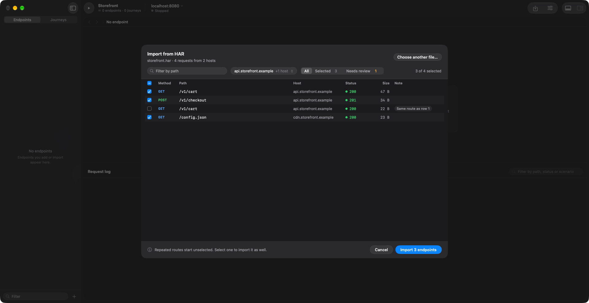

# Mimic

Mimic is a native macOS app that runs local mock API servers. Define endpoints and responses, switch scenarios, script multi-request journeys, simulate failures, and inspect live traffic. A CLI and a token-protected loopback API let tests and agents drive the same project without clicking through the window.

[](https://developer.apple.com/macos/)
[](LICENSE)
[](#testing)
[](#testing)



*The sample project: configure a response, switch scenarios, and inspect requests in the same window.*

## Install

Download the [latest release](https://github.com/srpadrono/mimic/releases/latest) and run its signed `.pkg`. It installs `Mimic.app` in `/Applications` and `mimic` in `/usr/local/bin`. To build from source, see [Contributing](CONTRIBUTING.md).

## Tutorial

This walkthrough takes about ten minutes. You will call the sample project's endpoints with `curl`, watch the requests arrive, switch a response to a failure, script a retry, forward unmocked calls to a real backend, and start a project of your own. You need Mimic installed and a terminal.

### Four ideas

- A **project** is one mock setup: its endpoints, scenarios, journeys, and local ports. Mimic keeps your projects and can reopen the last one at launch.
- An **endpoint** is a method and a path, such as `GET /account-summary`. A path can contain `:param` segments, so `/products/:id` matches `/products/42`.
- A **scenario** is one response for an endpoint: a status, a body, headers, and an optional delay. An endpoint can have several; exactly one is **live** and answers every request.
- A **journey** scripts a flow across endpoints, so the same route can answer differently as a client moves through it.

### 1. Open the sample project

The welcome window opens when Mimic starts. It offers four ways in: **New project…** (⌘N), **Import HAR or OpenAPI…**, **Open project export…** (⌘O), and **Try the sample project**. Projects you have opened are listed on the right. Tick **Show this window when Mimic opens** to see it at every launch; otherwise Mimic reopens the last project.



Choose **Try the sample project**.

### 2. Find your way around

The sample project has four endpoints and one journey. The window has four areas:

- **Navigator** (left): the **Endpoints** and **Journeys** tabs.
- **Editor** (middle): the live scenario of the selected endpoint, with its status, delay, content type, body, and headers. **Format** tidies a JSON body.
- **Inspector** (right): the endpoint's scenarios, its group and port, what happens to unmatched requests, and a traffic summary.
- **Request log** (bottom of the middle): every request the server has answered.

The toolbar holds the **Run** button, the project's server address and state, and, on the right, the Import and Server settings buttons. In a narrow window it folds those two into a ⋯ menu.

Select `/account-summary` to see its response.

### 3. Start the server and send a request

Press **Run**. The status changes to **Running** on `localhost:8080`. In a terminal:

```bash
curl -i http://127.0.0.1:8080/account-summary
```

You get `200` and `{"balance":1520.44,"currency":"USD","accounts":2,"frozen":false}`, and the request appears in the log with its time, method, path, and status. Change the status or body in the editor while the server runs; the next request uses the new response, with no restart.

### 4. Switch scenarios

`/account-summary` has two scenarios in the inspector: **Balance** (`200`, live) and **Server error** (`500`). Select **Server error** and press **Make live**, then send the request again: it now returns `500`. Make **Balance** live to go back. The **+** beside **Scenarios** adds your own.

### 5. Inspect traffic and fill the gaps

Ask for something Mimic does not know:

```bash
curl -i http://127.0.0.1:8080/orders
```

Mimic answers `404` and logs the call as unmatched. Open the log's **Unmatched** tab and select the request. Its detail opens beside the log, organised into **Request**, **Response**, and **Timing** tabs, with **Copy as cURL** and, for an unmatched call, **Create endpoint**.



**Create endpoint** adds `GET /orders` with a default response for you to edit. To add one from scratch, choose File ▸ New Endpoint… (⌥⌘N), pick the method and path, give it a name and optionally a group, set its status and content type, and press **Add endpoint**.



### 6. Script a flow with a journey

Real clients retry. Open the **Journeys** tab, select **Retry after failure**, and press **Activate**. The journey lists four steps: log in, load the account summary (it fails), load the inbox, and load the account summary again (it succeeds). Send the request twice:

```bash
curl -i http://127.0.0.1:8080/account-summary   # 500: the scripted failure
curl -i http://127.0.0.1:8080/account-summary   # 200: the retry succeeds
```

The step list shows where the run is; **Restart** rewinds it and **Next step** skips the current step. Click the **Active** badge to end the run; endpoints answer from their live scenarios again. **Capture from log** builds a journey from requests you have already made. See [Journeys](docs/JOURNEYS.md).



### 7. Forward what you have not mocked

Press the Server settings button in the toolbar (the sliders icon), or click the server address and choose **Server settings…**. Each port is a local listener: add one with **+**, name it, and give it a port number; the sheet says whether the port is available. Turn on **Forward unmatched requests** and enter the **Upstream URL**, and requests with no matching endpoint go to your real server. **Save forwarded responses as scenarios** keeps complete text responses as mocks; credential headers are removed, but check the bodies before you share a project. A forwarded call in the request log also offers **Save response as mock**. Press **Apply**; a running server needs a restart to use port changes.



### 8. Start a project of your own

Close the project (File ▸ Close Project) and choose **New project…** (⌘N) in the welcome window. Name it and pick a port; the sheet says whether the port is available. The project opens empty and offers three ways to begin:

- **Add endpoint**: write responses by hand.
- **Import HAR**: turn traffic recorded in Proxyman, Charles, or your browser's DevTools into endpoints.
- **Import OpenAPI**: turn each operation of an OpenAPI 3 or Swagger 2 spec, as JSON, into an endpoint with its example response.



An import opens a review sheet before it changes anything. Pick the requests to keep, hide a whole host from the host menu, and preview a captured body with the eye button on the row under the pointer. Repeated routes start unselected; select one to import it as well. Then press the button at the bottom right, which says how many endpoints it will create.



To move a project between machines, use `mimic project export` and open the file with File ▸ Open Project Export… (⌘O).

### Where next

The same project can be driven from a terminal; the next section starts there. [Journeys](docs/JOURNEYS.md) covers how a run matches and advances, and [GraphQL](docs/GRAPHQL.md) covers telling GraphQL operations apart on a shared `POST /graphql`.

## Try it from the command line

```bash
mimic app start
mimic project create "Checkout" --port 8080
mimic endpoint create GET /account-summary --status 200 --body '{"balance":128.4}'
mimic server start
curl http://127.0.0.1:8080/account-summary
```

Edit an endpoint or activate a different scenario while the server runs; the next request uses the new response. Routes can contain `:param` segments. Unmatched requests appear in the request log, where you can turn them into endpoints or journey steps.

A **journey** returns different results as a client moves through a flow. For example, the built-in retry journey fails the first account-summary request and succeeds on the next. Steps can also drop a connection or hold it long enough to exercise a client timeout. See [Journeys](docs/JOURNEYS.md).

```bash
mimic journey add-template retry-after-failure --activate
mimic reset --scope all
mimic journey status
mimic log list --unmatched
```

Projects can have multiple named local ports. Each port can optionally forward unmatched requests to a real upstream, and you can save a complete text response as a local mock. Review captured bodies before sharing a project. See [CLI and control API](docs/CLI.md) and [Security](SECURITY.md).

## Automation

`mimic daemon start` runs the same app without a window. Commands return JSON and meaningful exit codes. `mimic commands` lists the operations supported by the running instance; `mimic state` reports its current state. For isolated automation, use the repository's [CLI end-to-end harness](Scripts/run_cli_e2e.sh), which runs a disposable app copy and store. See [CLI and control API](docs/CLI.md) for discovery, tokens, environment variables, and examples.

HAR and OpenAPI or Swagger JSON **spec import** require the window's review sheet. `mimic project import` instead loads a Mimic project export. An update can be checked from the CLI; installing it requires the macOS installer in the window.

## How it works

The embedded Vapor server runs in the app process. `Domain` owns matching, journey resolution, and project commands; `MockServerEngine` serves requests; `Persistence` stores projects; `AppFeatures` coordinates the window and the single production control host. `ControlPlane` exposes that host over loopback, and `MimicCLICore` is a client. [Architecture](docs/ARCHITECTURE.md) explains the boundaries and where to add behavior.

## Testing

Run `swift test` for portable modules or the focused Xcode checks in [Contributing](CONTRIBUTING.md#test-gates). Local UI checks select the affected test methods; the full UI suite runs only in CI. `./Scripts/ci.sh` runs the local non-UI, Release-build, and CLI gates.

CI publishes coverage badges from merged unit and UI runs on `main`. Line coverage combines the app target and eight first-party modules, weighted by executable lines; the module badge counts how many of those eight reach 95%. Coverage measures exercised lines, not correctness or release acceptance. The optional table below describes its own supplied result bundles and can differ from the badges.

<!-- coverage:generated:start -->
<!-- coverage:generated:end -->

## Reference

- [CLI and control API](docs/CLI.md) — commands, exit codes, discovery, and HTTP format
- [Journeys](docs/JOURNEYS.md) and [GraphQL](docs/GRAPHQL.md) — matching and flow behavior
- [Architecture](docs/ARCHITECTURE.md) — modules and source-of-truth rules
- [Security](SECURITY.md) — local servers, credentials, and captured data
- [Contributing](CONTRIBUTING.md) — build, test, and release commands
- [Roadmap](docs/ROADMAP.md) and [Changelog](CHANGELOG.md) — current limits and release history

MIT licensed. See [LICENSE](LICENSE). The vendored code editor in `Vendor/CodeEditorView` keeps its Apache 2.0 licence; [Vendor](Vendor/README.md) says what Mimic changed.
