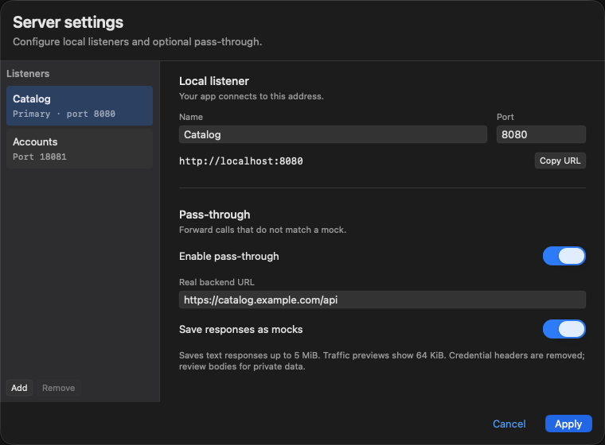

# Design-system conformance review

Captured from the Debug macOS app on 2026-09-22 with isolated XCUITest projects. The original review passed 12 UI flows, and the corrected server-settings sheet passed all five backend UI flows. The 75 design-system and import-row contrast tests and all 11 house rules also passed.

An independent design review checked hierarchy, spacing, color meaning, and narrow-window behavior. The follow-up aligned editor and panel headers, navigator rows, form sections, status badges, and request-log controls. The server-settings sheet now shows a compact listener list beside one editable listener, with controls that align across the detail pane and a sheet height that follows its content. Pending listener ports read honestly, and Method, Path, Status, and Time remain visible in the compact log.

The journey editor now gives the title room to wrap, names each step above its method and route, and keeps matching settings in a disclosure. Both short steps remain visible above the request log in the compact window. The inspector separates the selected journey from the active run; when the server is stopped, the run controls and inspector explain how Restart and Advance prepare the next start. Focused journey editing, grouping, inspector, breadcrumb, and compact-window UI flows passed.

## Workspace and navigator

## Editing sheets

