# Design-system conformance review

Captured from the Debug macOS app on 2026-09-22 with isolated XCUITest projects. The final focused run passed all 12 UI flows; 75 design-system and import-row contrast tests and all 11 house rules also passed.

An independent design review checked hierarchy, spacing, color meaning, and narrow-window behavior. The follow-up aligned editor and panel headers, navigator rows, form sections, status badges, and request-log controls. It also made pending listener ports and stopped journeys read honestly, and kept Method, Path, Status, and Time visible in the compact log.

## Workspace and navigator

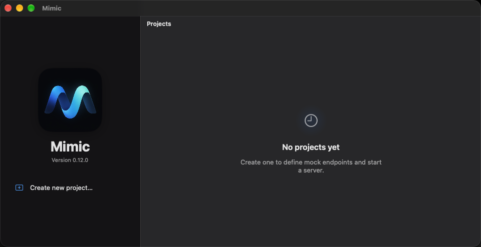

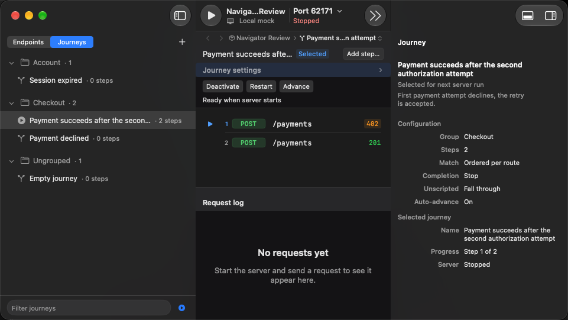

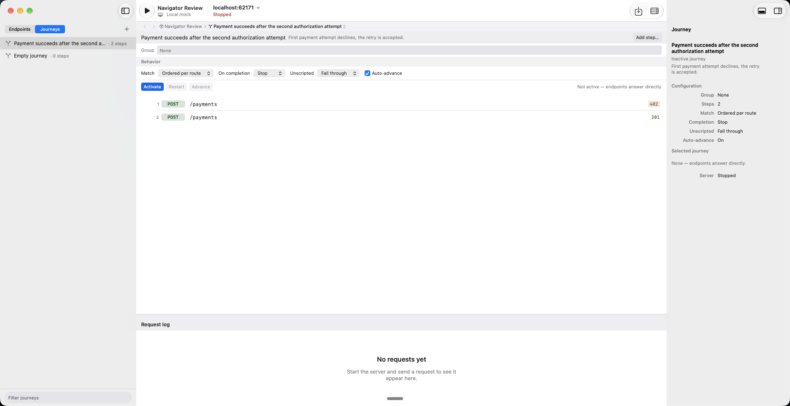

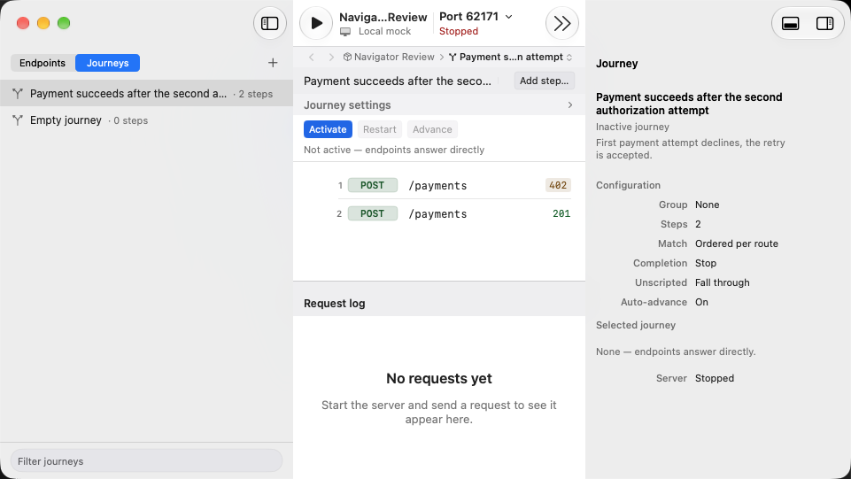

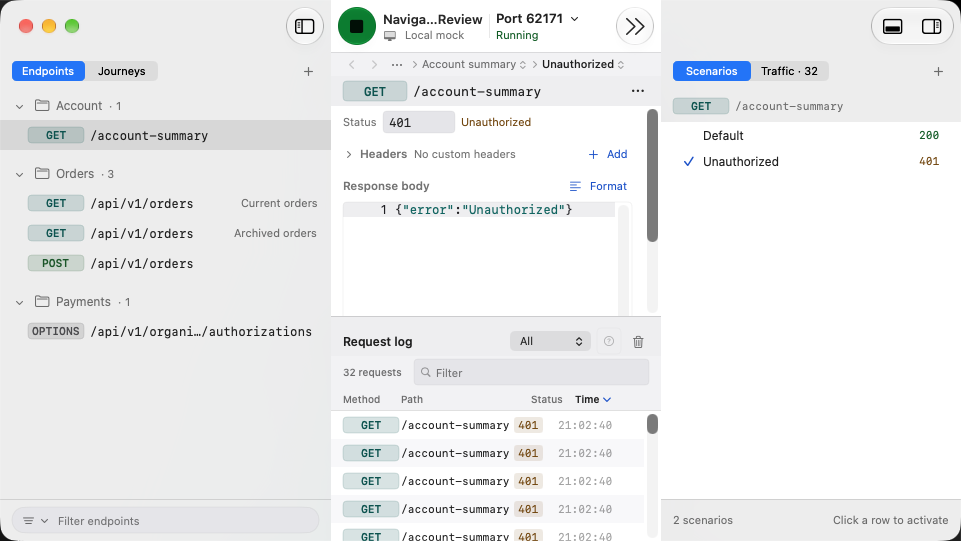

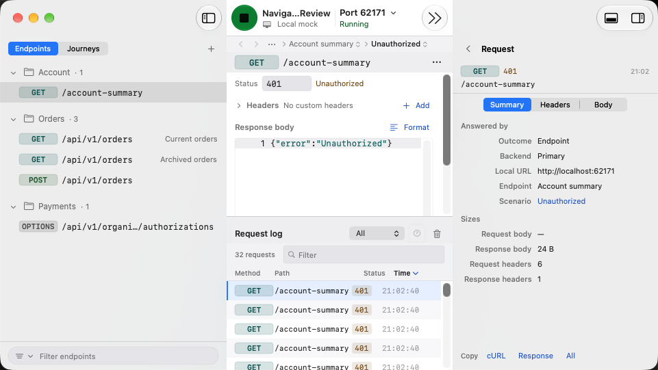

## Editing sheets

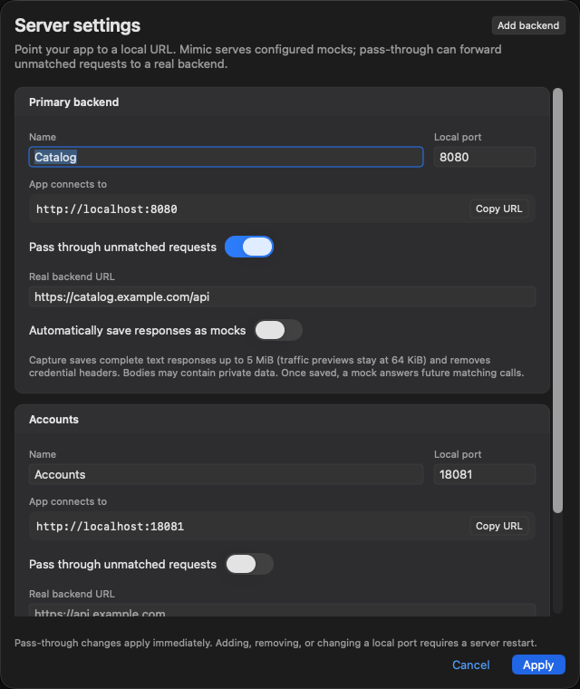

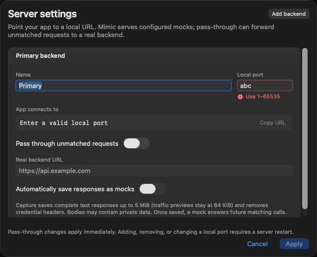

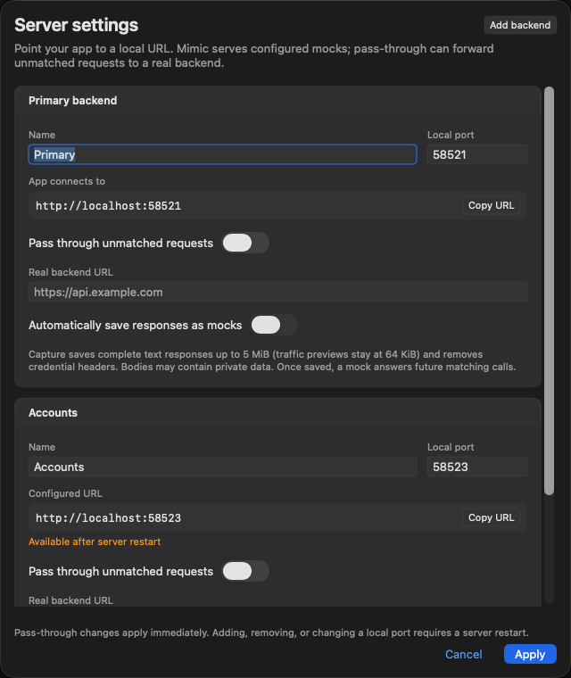

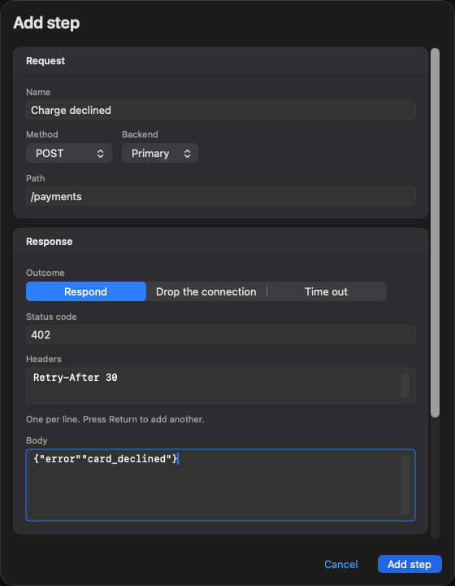

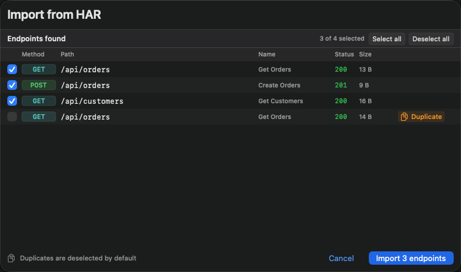

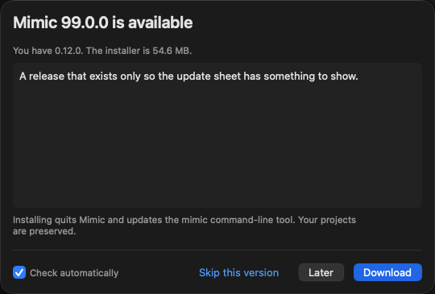
