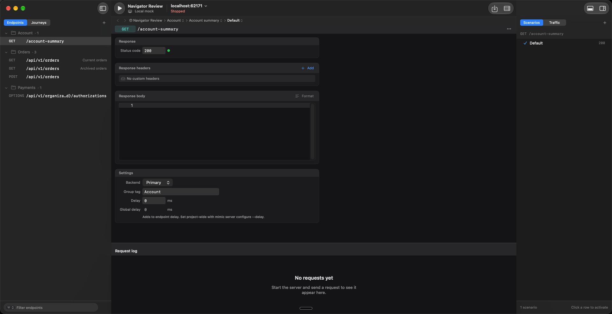
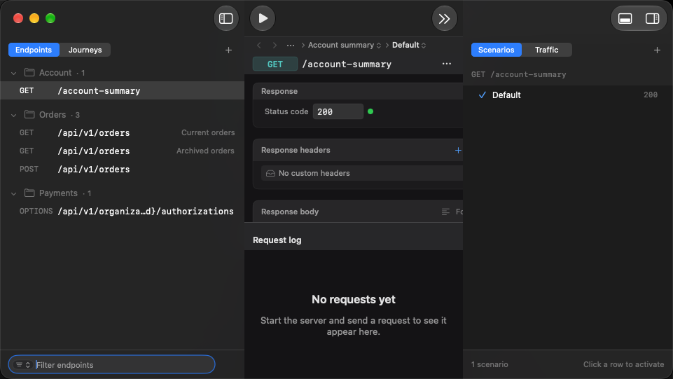
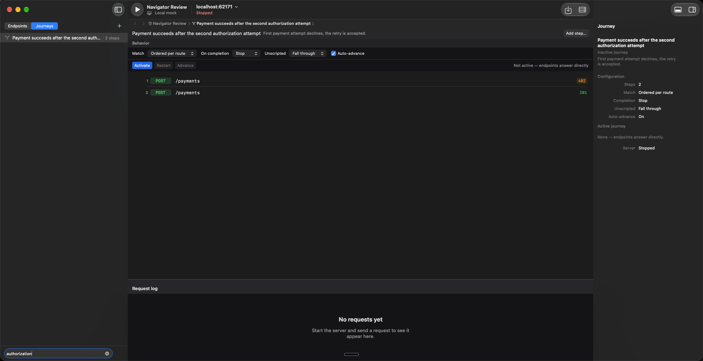
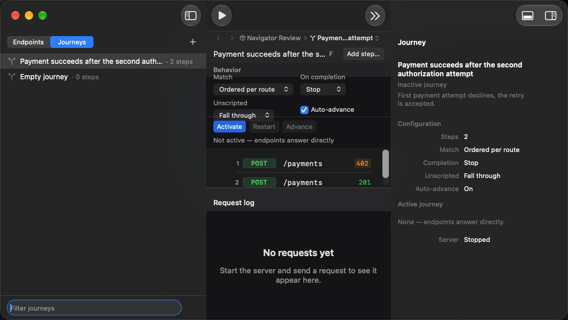
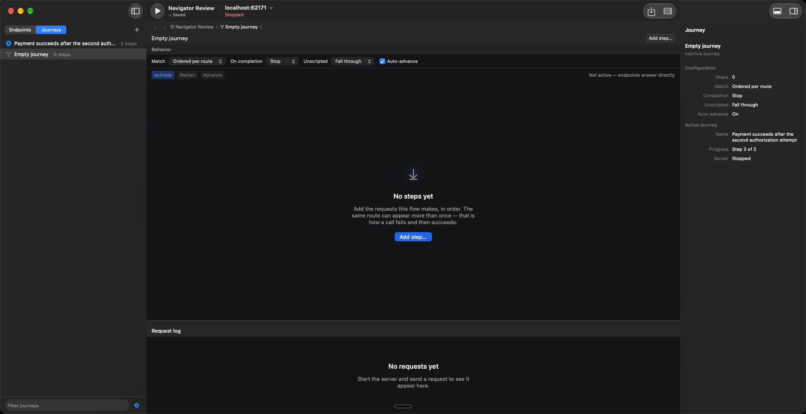
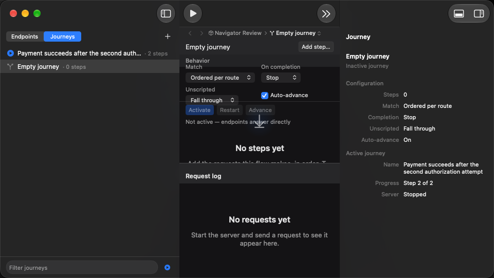
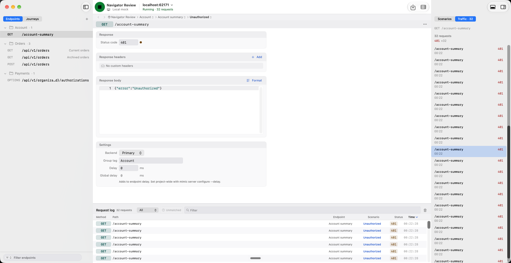
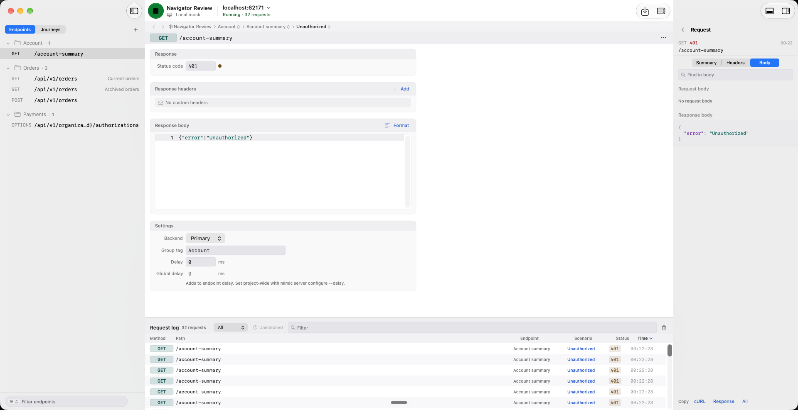

# Navigator and inspector review

Captured on 2026-09-22 from the actual Debug app with isolated XCUITest demo projects. These are screenshots, not mockups.

The navigator uses shared row spacing and icon columns, counts beside group names, native tabs, and persistent bottom filters. The inspector separates journey selection from the active run and preserves traffic scroll position when returning from request details. Wide and narrow layouts were inspected.

Local validation before synchronization with main: Debug build; 240 selected unit tests and 17 distinct focused UI tests passed across verification runs. The final corrective checks passed 12 rendering tests and the narrow-window UI regression. House rules, documentation counts, UI shard coverage, and whitespace checks passed. This is focused local evidence, not a full-suite or release claim.

## Endpoints, wide

## Endpoints, narrow

## Journeys, wide

## Journeys, narrow

## Selected journey and active run

## Journey inspector, narrow

## Traffic list

## Request body

