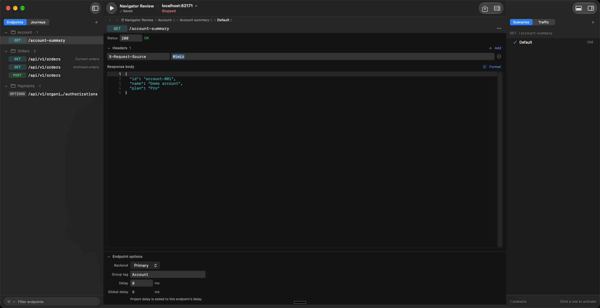
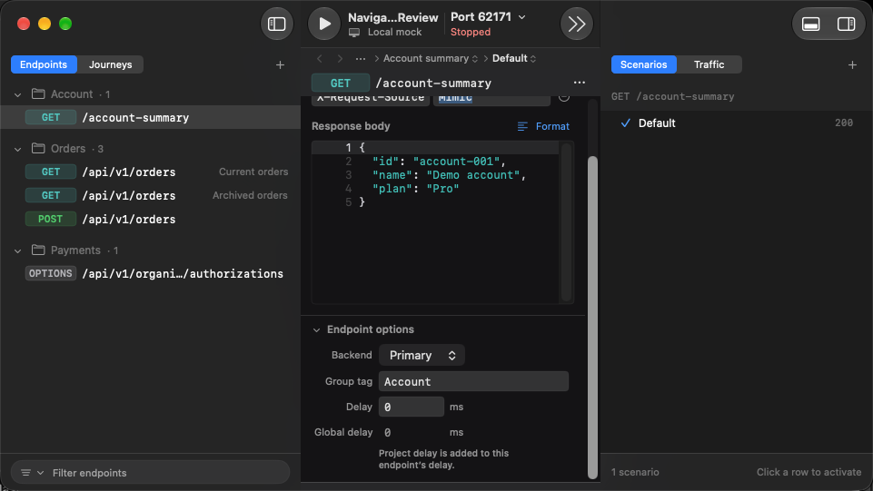

# Navigator, endpoint editor, and inspector review

Captured on 2026-09-22 from the actual Debug app with isolated XCUITest demo projects. These are screenshots, not mockups.

The navigator uses shared row spacing and icon columns, counts beside group names, native tabs, and persistent bottom filters. Journeys now support saved groups through the editor’s Group field and CLI `--group`, using the same disclosure component as Endpoints. Clearing Group leaves a journey ungrouped. The inspector separates journey selection from the active run and preserves traffic scroll position when returning from request details. Wide and narrow layouts were inspected.

Local validation before synchronization with main: Debug build; 240 selected unit tests and 17 distinct focused UI tests passed across verification runs. The final corrective checks passed 12 rendering tests and the narrow-window UI regression. House rules, documentation counts, UI shard coverage, and whitespace checks passed. This is focused local evidence, not a full-suite or release claim.

Grouping follow-up: 597 selected unit tests passed (Domain 303, CLI 114, Persistence 96,
DesignSystem 72, and 12 journey/workspace rendering tests), plus all six navigator UI tests.
The final compact-layout correction reran the 12 rendering tests and both affected journey UI
flows successfully. The grouped screenshots below are from that final run. UI assertions compare
actual endpoint/journey row heights, header insets, consecutive-row spacing, collapse retention,
filter reveal, group creation/moving/clearing, and non-overlapping compact controls. Persistence
checks cover migrating an existing store and saving/reopening group membership.

Filter and method-pill follow-up: endpoint rows now use the same compact colored method badges
as journey steps. The filter has balanced eight-point inner padding, a larger scope control, and
no empty active-journey slot. The follow-up passed 72 design-system and four workspace rendering
tests plus three focused UI flows (geometry/filter retention, method scope/active-journey reveal,
and scenario/traffic navigation). Endpoint and traffic captures below were refreshed after this change.

Endpoint editor follow-up: a compact status row replaces the Response card, headers expand into
editable rows, and the response body fills the center pane with consistent 12-point side insets.
Endpoint options are collapsed below the editor. Short windows can scroll to the last option;
collapsing options commits a focused field. The unexplained status dot and CLI-only delay hint
have been replaced with a status description and a plain-language explanation. Nine endpoint
rendering/pending-edit tests and eight distinct focused UI flows passed across the follow-up runs.
The UI checks cover header add/remove and reopen, JSON formatting and reopen, invalid JSON,
status validation, delay blur/reopen and invalid input, read-only project delay, full-width geometry,
disclosures, focused-field commit on collapse, and scrolling to the final option in a short window.
The initial reopen selectors were updated to target the combined accessible navigator rows.
Endpoint captures below are refreshed; journey and inspector captures retain their earlier verified states.

## Endpoints, wide

## Endpoints, narrow

## Endpoint headers and options, expanded

## Endpoint options, short window scrolled to the bottom

## Grouped journeys, wide

## Grouped journeys, narrow

## Selected journey and active run

## Journey inspector, narrow

## Traffic list

## Request body

