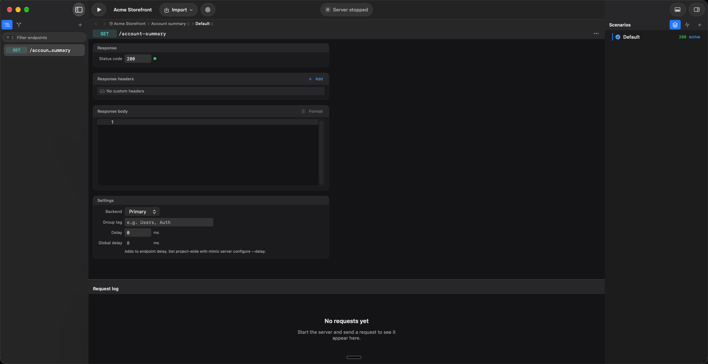
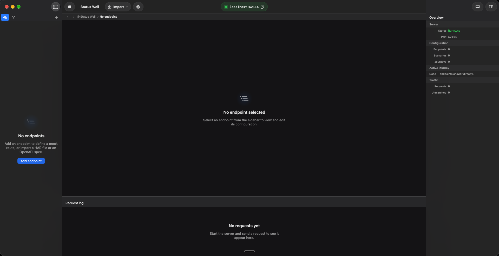
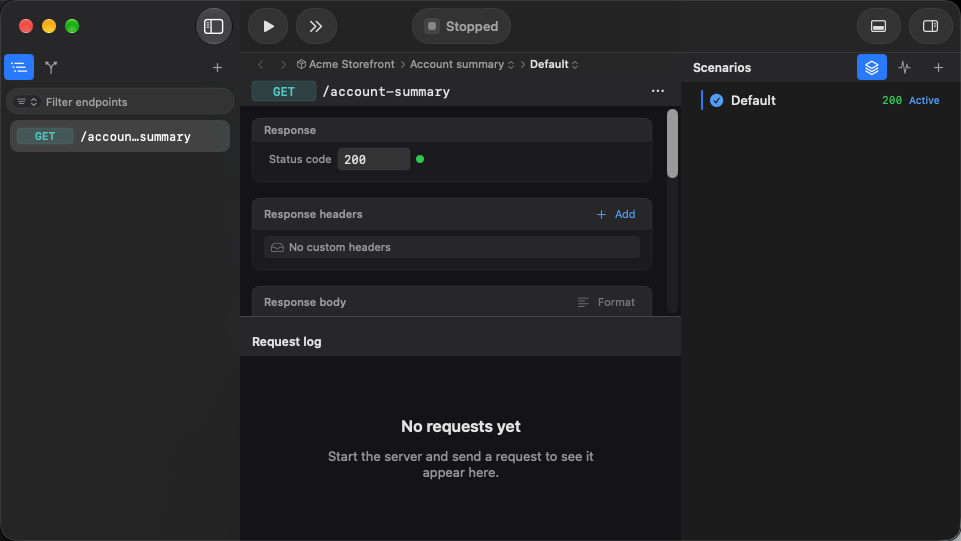
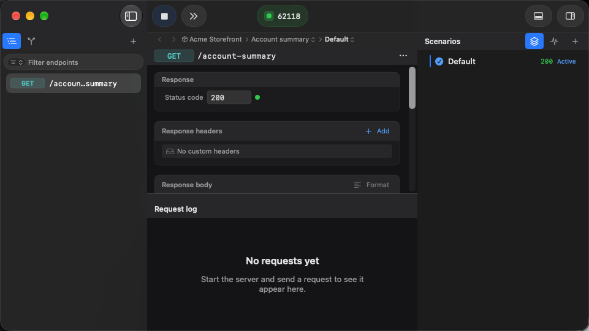
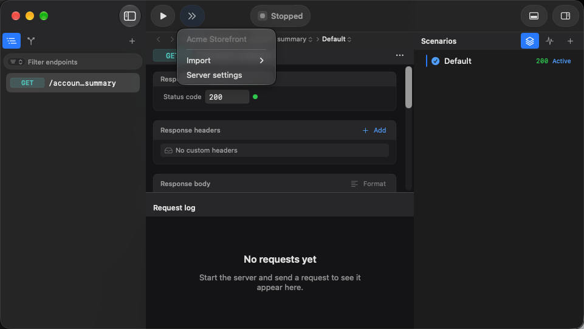

# Toolbar consistency evidence

These are unedited window screenshots from the rebuilt macOS app, using isolated synthetic
projects. They supersede the toolbar arrangement in the earlier window-polish captures.

Captured on 21 September 2026 by the two focused `WorkspaceShellUITests` toolbar/copy tests.
Expanded captures are 1920 × 988 pixels; compact captures are 961 × 541. Light appearance was
also checked in the live app, including Run/Stop, copying, Import, and hiding/showing the inspector.
The developer's system appearance was not changed.

## Design contract

- All action pills and the status well have a 36-point outer height and a shared vertical center.
- Pills use 12-point horizontal insets and a 16-point content lane. The complete button surface
  responds to hover and clicks; the address and unmatched-request targets also span the well's height.
- Run and Stop are one fixed-size control. The symbol changes in place, transition states disable
  repeat activation, and symbol replacement respects Reduce Motion.
- The address has a copy/checkmark affordance, not a smaller button nested inside its pill.
- Save status occupies a reserved inline slot, rather than displacing the status well vertically.
- The editor's actions collapse into its menu. Only request-log and inspector toggles occupy the
  right-hand toolbar; neither is moved into the editor menu.

## Expanded, stopped

## Expanded, running

## Compact, stopped and running

## Compact menu

## Verification scope

The focused UI checks cover expanded/compact geometry, the single Run/Stop target, start/stop,
address copying, the unmatched-request action, panel-control separation, and saving/saved/failed
save states. Rendering tests independently pin the 36-point height and 40-by-36 Run/Stop footprint
using literal expectations, including starting, stopping, and error states.

Passing result bundles:

- `Test-Mimic-Workspace-2026.09.21_09-36-35-+0100.xcresult`: all five focused UI cases.
- `Test-Mimic-Workspace-2026.09.21_09-41-30-+0100.xcresult`: 35 focused unit tests and both
  toolbar/copy UI cases, rerun after the final Import-label sizing correction. The screenshots
  above come from this bundle.
- `Test-Mimic-Workspace-2026.09.21_09-46-10-+0100.xcresult`: six facade tests, including the
  exact expanded/compact breakpoint and invalid-width cases. Total: 41 focused unit tests.

These captures do not prove every application workflow, every animation frame, or CI readiness.
No full UI suite or CI-status check is part of this change.

## Database review setup

The previous manual review had selected an older release by app name while a Debug copy was also
running. Its requested `/tmp` store was outside the sandbox and did not produce an on-disk review
database. The corrected review launches the exact rebuilt app executable with an explicit,
separate database under the app's container, and a separate preferences suite.

An open-file inspection confirmed the isolated SQLite file. The synthetic `Toolbar Review` project
and port `62130` survived a process restart and appeared again in the rebuilt app. This verifies
persistence for that review fixture, not recovery of arbitrary databases. No database migration or
production database reset is introduced by this PR.
