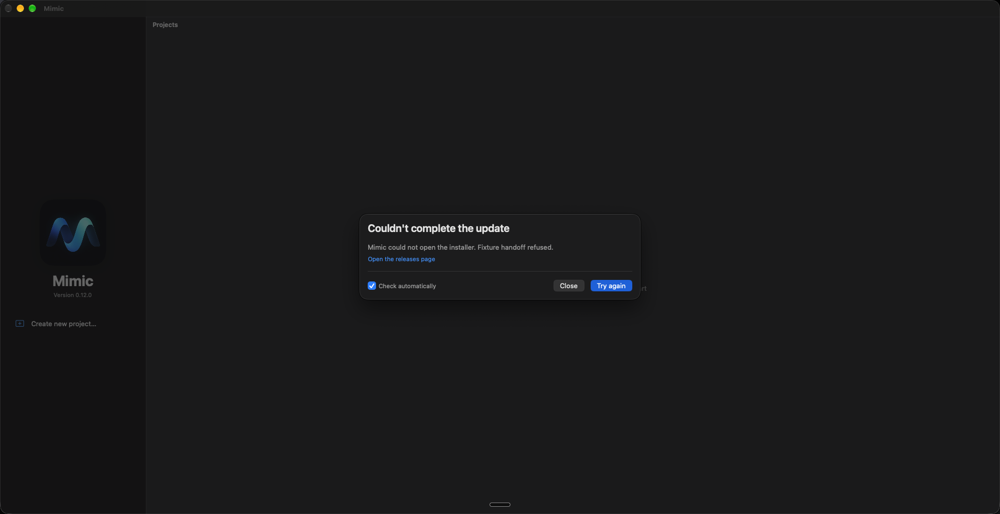

# Update quit regression

## Reproduction and fix

The original flow requested app termination while its SwiftUI update sheet was still attached.
The focused `testQuitAndInstallTerminatesAfterHandoff` regression failed: Mimic remained running
after the test clicked **Quit and install** and waited 15 seconds.

The corrected flow saves, snapshots, and hands off the installer, then dismisses the sheet.
Only the sheet's `onDismiss` completion requests normal AppKit termination. The app delegate's
save/drain path remains intact. Preparation is a busy state, preventing duplicate handoffs and
cancellation during the committed installation sequence. A failed handoff leaves the error visible
and does not quit.

## Evidence boundaries

The UI regression uses the real sheet, button, dismissal, app delegate and process termination.
The release feed, downloaded package and external installer handoff are **Debug-only fixtures**.
No package was installed, no administrator consent was requested, and no production project
database was used. These checks prove the quit regression and error handling, not a full signed
package installation or a published release.

Screenshots show the simulated ready state and a deliberately refused installer handoff; a
static screenshot cannot prove that a process exited. The passing process-state assertion supplies
that evidence.

## Focused validation

Final run: **26 unit tests and 9 update UI tests passed**, 21 September 2026.
Result bundle: `Test-Mimic-Workspace-2026.09.21_09-56-54-+0100.xcresult`.

- `MimicTests/UpdateServiceTests`
- `MimicTests/UpdateInstallationTests`
- `MimicTests/UpdateInstallerTests`
- `MimicTests/ControlPlaneCoordinatorTests`
- `MimicUITests/UpdateUITests`

No full UI suite or CI checks were run.

## Screenshots

Unedited app-window captures from the targeted UI run, using a simulated 99.0.0 update.

