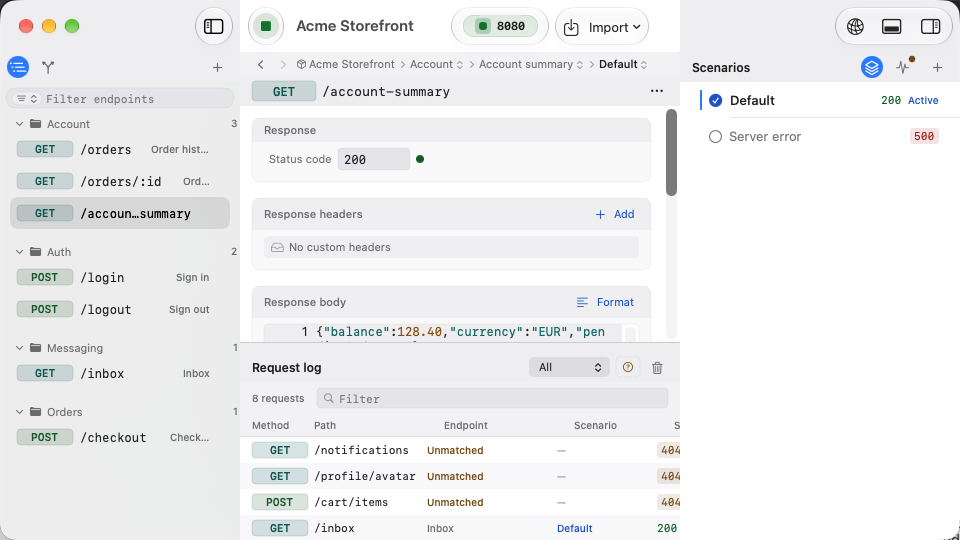
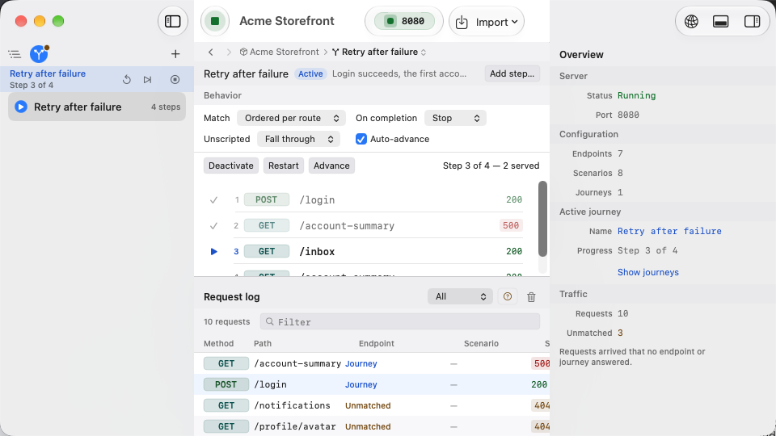
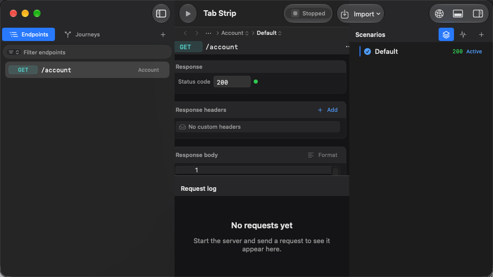
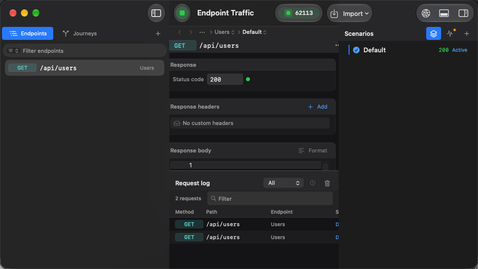
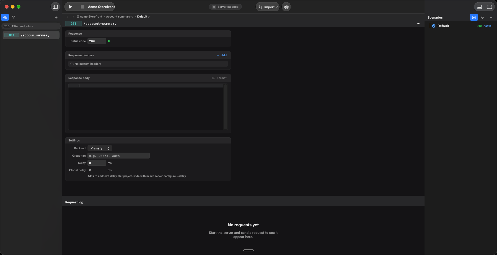
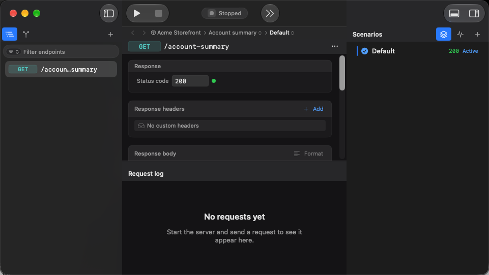
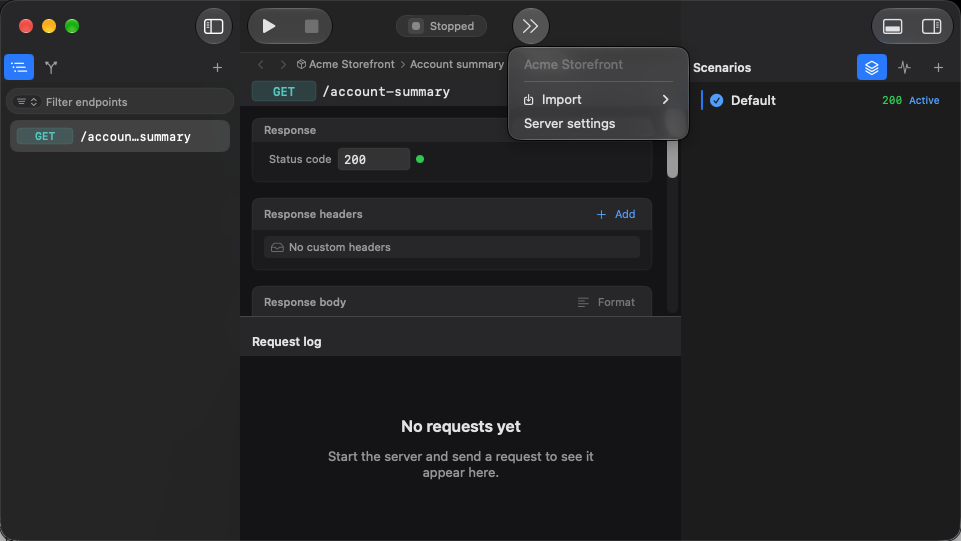

# Window polish screenshot evidence

Captured on 20 September 2026 from the real Mimic app using the isolated, synthetic
Acme Storefront fixture. These are unedited XCUITest window captures, not mockups.
Both images are 960 × 540 pixels in light appearance.

Source: passing focused test
`DocScreenshotTests/testCaptureWorkspaceAndJourneys()` in
`/tmp/mimic-ui-polish-light-20260920.xcresult`. Captured app sources match commit
`2dc9fd8`; no full UI suite or CI checks were run for this evidence update.

## Endpoint workspace

Shows compact toolbar/status controls, grouped sidebar and search, breadcrumb
navigation, endpoint editor, scenario inspector, and populated request log with
its adaptive two-row controls.

## Journey workspace

Shows journey navigation, wrapped behavior controls, active run progress, step
list, populated request log, and the project overview inspector when Journeys is
selected. The fixture has served two journey steps.

These screenshots document the visible states above. They do not claim coverage
of every dialog, animation, or window size; those checks are described separately
in PR #78.

## Adaptive navigation and taller search fields

The following later capture shows the updated 26-point navigation buttons and
search fields. The navigator uses icons at 240 points and icon-and-title buttons
at 340 points; the panel header keeps its 30-point height in both states.

The focused navigation UI test verifies navigation and button height and captures
the real app window with an isolated synthetic project. The compact/expanded
transition was verified separately in the live app at 240 and 340 points; the
XCUITest pointer drag did not reliably move the native divider, so it is not used
as evidence of resizing. Source result bundle:
`/tmp/mimic-navigation-screenshot-final.xcresult`.

## Adaptive inspector tabs

Scenarios and Traffic now use the same 26-point adaptive buttons as the navigator.
Live inspection verified icon-only controls at a 220-point inspector width and
icon-and-title controls at 380 points, including switching between both tabs.
The panel title and Add scenario action remain visible in the compact state.

The screenshot below is from the passing focused inspector traffic test with
synthetic requests. All 11 design-system checks also passed in
`/tmp/mimic-inspector-adaptive.xcresult`. It records the compact layout; expanded
layout screenshots were inspected directly in the live app.

## Center toolbar and separate panel controls

This revision supersedes the toolbar shown in the earlier captures. The reference
was the actual Xcode 27 beta 6 window, inspected at expanded and compact widths:
editor actions overflow before the inspector divider, while the inspector control
stays separate. Apple's [inspector toolbar guidance](https://developer.apple.com/videos/play/wwdc2023/10161/)
also documents the distinction between main-content and inspector toolbar sections.

Mimic now keeps Run/Stop and server status in the center toolbar. Import and server
settings are inline when the center has room, and move into its double-chevron
menu when that panel narrows. The far-right section contains only the request-log
and inspector toggles; neither moves into the center menu.

Live checks also resized the side panels at a fixed window width, including a
running mock server with a synthetic `/account-summary` request. Center actions
collapsed and expanded without moving the two right-hand panel toggles.

The following unedited XCUITest window screenshots use isolated synthetic data,
in dark appearance. They document the toolbar layout, not a complete app regression.
The expanded capture is 1920 × 988 pixels; the compact captures are 961 × 541.
Source: the passing
`WorkspaceShellUITests/testCenterToolbarOverflowKeepsPanelControlsSeparate()` in
`/tmp/mimic-center-toolbar-three-panels.xcresult`, captured on 20 September 2026.

Validation for this revision: 26 focused unit checks passed in
`/tmp/mimic-center-toolbar-units.xcresult`. The center-toolbar test and both nested
import-sheet actions passed in `/tmp/mimic-center-toolbar-final.xcresult`; panel
shortcuts and copying the server address passed in the earlier focused batch.
Earlier test attempts used stale menu identifiers and an incorrect assumption that
opening space in the center should leave it compact; those test expectations were
corrected and rerun. No full UI suite or CI checks were run.

